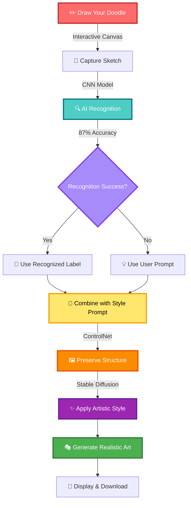

<div align="center">


<br/>


<h3>✨ Transform Your Sketches into Stunning Realistic Art with AI ✨</h3>

<br/>


<p align="center">
  
  
  
  
</p>

<p align="center">
  <a href="https://github.com/RohithCherukuri816/AI-Powered-Creative-Intelligence-Platform">
    
  </a>
  
</p>

---

### 🌟 Transform your simple doodles into stunning, realistic artwork with intelligent AI recognition and professional styling

</div>

---


<div align="center">

## ✨ Features & Capabilities


</div>

<table>
<tr>
<td align="center" width="50%">


<h3>🤖 MobileNet Recognition</h3>

<ul align="left">
<li><b>100+ Categories:</b> Recognizes vehicles, animals, objects, and more</li>
<li><b>Efficient Architecture:</b> MobileNetV2/V3 for fast inference</li>
<li><b>Transfer Learning:</b> Pre-trained on ImageNet, fine-tuned on Quick Draw</li>
<li><b>Real-time Processing:</b> Optimized for mobile and web deployment</li>
<li><b>Confidence Scoring:</b> Shows prediction confidence levels</li>
<li><b>Smart Fallback:</b> Keyword-based recognition when model unavailable</li>
</ul>

</td>
<td align="center" width="50%">


<h3>🎨 Stable Diffusion Generation</h3>

<ul align="left">
<li><b>ControlNet Integration:</b> Preserves sketch structure during generation</li>
<li><b>Stable Diffusion:</b> High-quality image generation from sketches</li>
<li><b>Style Prompts:</b> Watercolor, digital, vintage, photorealistic</li>
<li><b>Smart Enhancement:</b> Auto-enhances prompts with quality modifiers</li>
<li><b>Structure Preservation:</b> Maintains original sketch composition</li>
<li><b>Fallback Processing:</b> Traditional image processing when AI unavailable</li>
</ul>

</td>
</tr>

<tr>
<td align="center">


<h3>🎯 Interactive Canvas</h3>

<ul align="left">
<li><b>Multi-Tool Support:</b> Brush, eraser with customizable sizes</li>
<li><b>Color Palette:</b> 10+ colors for creative expression</li>
<li><b>Undo/Redo:</b> Full history management</li>
<li><b>Keyboard Shortcuts:</b> Professional workflow (Ctrl+Z, Ctrl+S)</li>
<li><b>Touch Support:</b> Works on tablets and touch devices</li>
<li><b>Download Sketches:</b> Save your drawings locally</li>
</ul>

</td>
<td align="center">


<h3>🛡️ Production Ready</h3>

<ul align="left">
<li><b>Dual Backend:</b> Advanced AI + fallback processing</li>
<li><b>Complete Training:</b> Kaggle notebook included</li>
<li><b>Easy Integration:</b> Simple model integration guide</li>
<li><b>Comprehensive Docs:</b> Multiple guides for all levels</li>
<li><b>Error Recovery:</b> Graceful degradation</li>
<li><b>Scalable Architecture:</b> Ready for deployment</li>
</ul>

</td>
</tr>
</table>

---


## 🎬 **How It Works**

<div align="center">



</div>

### **Step-by-Step Process**

<table>
<tr>
<td width="33%" align="center">

**STEP 1: Draw**


Use the interactive canvas with customizable brushes and colors

</td>
<td width="33%" align="center">

**STEP 2: Recognize**


CNN model identifies your doodle from 100+ categories

</td>
<td width="33%" align="center">

**STEP 3: Style**


Describe your desired artistic style

</td>
</tr>
<tr>
<td width="33%" align="center">

**STEP 4: Preserve**


ControlNet maintains your sketch's structure

</td>
<td width="33%" align="center">

**STEP 5: Transform**


Stable Diffusion applies artistic effects

</td>
<td width="33%" align="center">

**STEP 6: Result**


Download your realistic, styled artwork!

</td>
</tr>
</table>

---

m
#
# 🏗️ **System Architecture**

### **Technology Stack**

<div align="center">

<p align="center">
  
</p>

</div>

<table>
<tr>
<td width="50%">

### **Frontend Technologies**

| Technology | Version | Purpose |
|-----------|---------|---------|
| **React** | 18.2.0 | UI framework |
| **Vite** | 4.5.0 | Build tool & dev server |
| **Tailwind CSS** | 3.3.5 | Utility-first styling |
| **Framer Motion** | 10.16.4 | Smooth animations |
| **Lucide React** | 0.292.0 | Icon library |
| **HTML5 Canvas** | Native | Drawing interface |

</td>
<td width="50%">

### **Backend Technologies**

| Technology | Version | Purpose |
|-----------|---------|---------|
| **FastAPI** | 0.109.2 | Web framework |
| **Uvicorn** | 0.27.1 | ASGI server |
| **PyTorch** | 2.2.0 | Deep learning |
| **TensorFlow** | 2.13.0 | Model training |
| **Diffusers** | 0.26.3 | Stable Diffusion |
| **ControlNet** | Latest | Structure preservation |
| **Pillow** | 10.2.0 | Image processing |
| **OpenCV** | 4.9.0 | Computer vision |

</td>
</tr>
</table>

### **AI Models**

<div align="center">

<table>
<tr>
<td align="center" width="33%">

<br/><br/>
<b>🧠 Doodle Recognition</b>
<br/>
<sub>100+ categories classifier</sub>
<br/>
<sub>Efficient mobile architecture</sub>
</td>
<td align="center" width="33%">

<br/><br/>
<b>🎯 Edge Control</b>
<br/>
<sub>Maintains sketch structure</sub>
<br/>
<sub>Canny edge detection</sub>
</td>
<td align="center" width="33%">

<br/><br/>
<b>✨ Image Generation</b>
<br/>
<sub>High-quality art creation</sub>
<br/>
<sub>Multiple style support</sub>
</td>
</tr>
</table>

</div>

### **Dual Backend System**

<table>
<tr>
<td align="center" width="50%">

<br/><br/>
<b>🔄 Fallback Processing</b>
<br/><br/>

<br/>

<br/>

<br/>

<br/><br/>
<sub>Works even without AI models</sub>
</td>
<td align="center" width="50%">

<br/><br/>
<b>🤖 Advanced AI</b>
<br/><br/>

<br/>

<br/>

<br/>

<br/><br/>
<sub>Production-grade AI transformations</sub>
</td>
</tr>
</table>

---


## 🚀 **Quick Start**

### **Prerequisites**

<table>
<tr>
<td align="center" width="25%">

<br/>
<b>Node.js 18+</b>
<br/>
<sub>Frontend development</sub>
</td>
<td align="center" width="25%">

<br/>
<b>Python 3.8-3.12</b>
<br/>
<sub>Backend & AI models</sub>
</td>
<td align="center" width="25%">

<br/>
<b>npm/pnpm</b>
<br/>
<sub>Package management</sub>
</td>
<td align="center" width="25%">

<br/>
<b>NVIDIA GPU</b>
<br/>
<sub>Faster AI (optional)</sub>
</td>
</tr>
</table>

### **Installation**

#### **Option 1: Automated Setup (Recommended)**

```bash
# Windows
scripts\setup.bat

# macOS/Linux
chmod +x scripts/setup.sh
./scripts/setup.sh
```

#### **Option 2: Manual Setup**

```bash
# 1. Clone the repository
git clone https://github.com/RohithCherukuri816/AI-Powered-Creative-Intelligence-Platform.git
cd AI-Powered-Creative-Intelligence-Platform

# 2. Install frontend dependencies
cd frontend && npm install && cd ..

# 3. Setup Python virtual environment and install backend dependencies
cd backend
python -m venv myenv
myenv\Scripts\activate  # Windows
# source myenv/bin/activate  # macOS/Linux
pip install -r requirements.txt
cd ..

# 4. Setup environment files
cp frontend/.env.example frontend/.env
# Edit frontend/.env to set VITE_API_URL=http://localhost:8000

# 5. Start development servers
npm run dev
```

### **Access Your Application**

<div align="center">

<table>
<tr>
<td align="center" width="25%">

<br/>
<a href="http://localhost:5174"><code>localhost:5174</code></a>
<br/>
<sub>⚛️ React Application (Auto-assigned port)</sub>
</td>
<td align="center" width="25%">

<br/>
<a href="http://localhost:8000"><code>localhost:8000</code></a>
<br/>
<sub>🐍 FastAPI Server</sub>
</td>
<td align="center" width="25%">

<br/>
<a href="http://localhost:8000/docs"><code>localhost:8000/docs</code></a>
<br/>
<sub>📚 Swagger UI</sub>
</td>
<td align="center" width="25%">

<br/>
<a href="http://localhost:8000/health"><code>localhost:8000/health</code></a>
<br/>
<sub>💚 Status Check</sub>
</td>
</tr>
</table>

</div>

---

## 🚀 **Current Project Status**

<div align="center">

<table>
<tr>
<td align="center" width="33%">

<br/><br/>
<b>Interactive Canvas</b>
<br/>
<sub>✅ Drawing tools & controls</sub>
<br/>
<sub>✅ Touch & keyboard support</sub>
<br/>
<sub>✅ Performance optimized</sub>
</td>
<td align="center" width="33%">

<br/><br/>
<b>API Infrastructure</b>
<br/>
<sub>✅ FastAPI server</sub>
<br/>
<sub>✅ CORS configured</sub>
<br/>
<sub>✅ Environment setup</sub>
</td>
<td align="center" width="33%">

<br/><br/>
<b>Model Integration</b>
<br/>
<sub>🔄 MobileNet training</sub>
<br/>
<sub>🔄 Stable Diffusion setup</sub>
<br/>
<sub>🔄 Hugging Face upload</sub>
</td>
</tr>
</table>

</div>

### **🤗 Hugging Face Integration Plan**

We're preparing to upload this project to Hugging Face with:

- **Model Repository**: MobileNetV2/V3 for efficient doodle recognition
- **Dataset Repository**: Processed Quick Draw dataset for training
- **Space Demo**: Interactive Gradio application for live testing
- **Community Access**: Open-source collaboration and contributions

**Implementation Roadmap:**
1. ✅ Environment setup and authentication
2. 🔄 MobileNet model training and optimization
3. 🔄 Stable Diffusion integration with ControlNet
4. 🔄 Hugging Face repositories creation and upload
5. 🔄 Interactive Space deployment and testing

---

## 🎓 **Train Your Own Model**

<div align="center">


</div>

### **Why Train?**

<table>
<tr>
<td align="center" width="50%">

<br/><br/>

<br/>

<br/>

<br/>

</td>
<td align="center" width="50%">

<br/><br/>

<br/>

<br/>

<br/>

</td>
</tr>
</table>

### **🚀 MobileNet Training (3 Steps)**

<table>
<tr>
<td width="33%" align="center">

**STEP 1**


1. Download Quick Draw dataset
2. Preprocess for MobileNet input
3. Create train/validation splits
4. Set up data augmentation

</td>
<td width="33%" align="center">

**STEP 2**


1. Load pre-trained MobileNetV2/V3
2. Apply transfer learning
3. Fine-tune on doodle data
4. Monitor validation accuracy

</td>
<td width="33%" align="center">

**STEP 3**


1. Save trained model weights
2. Upload to Hugging Face Hub
3. Integrate with application
4. Test end-to-end pipeline

</td>
</tr>
</table>

### **📊 Expected Results**

<div align="center">

<table>
<tr>
<td align="center" width="50%">

**📈 Training Metrics**


<br/>

<br/>

<br/>

<br/>


</td>
<td align="center" width="50%">

**🎯 Supported Categories**

```
🚗 Vehicles
   car, van, bus, bicycle, train
   airplane, helicopter, boat

🐾 Animals  
   cat, dog, bird, fish, horse
   elephant, lion, tiger, bear

🏠 Objects
   house, tree, flower, book
   chair, table, cup, phone

✨ 80+ more categories...
```

</td>
</tr>
</table>

</div>

### **📚 Training Documentation**

<div align="center">

<table>
<tr>
<td align="center">
<a href="training/QUICK_START.md">

</a>
<br/><sub>3-step guide</sub>
</td>
<td align="center">
<a href="HOW_TO_TRAIN.md">

</a>
<br/><sub>Full instructions</sub>
</td>
<td align="center">
<a href="training/KAGGLE_GUIDE.md">

</a>
<br/><sub>Kaggle details</sub>
</td>
</tr>
<tr>
<td align="center">
<a href="INTEGRATION_GUIDE.md">

</a>
<br/><sub>Model integration</sub>
</td>
<td align="center">
<a href="TRAINING_INDEX.md">

</a>
<br/><sub>Doc index</sub>
</td>
<td align="center">
<a href="training/kaggle_training.ipynb">

</a>
<br/><sub>Training notebook</sub>
</td>
</tr>
</table>

</div>

---


## 🎨 **Usage Guide**

### **Basic Workflow**

<table>
<tr>
<td width="33%" align="center">


**1. Draw Your Sketch**

- Use interactive canvas
- Choose brush size & color
- Draw your idea freely
- Use undo/redo as needed

</td>
<td width="33%" align="center">


**2. Add Style Prompt**

- Describe desired style
- Example: "realistic car, vibrant"
- System auto-recognizes doodle
- Combines label + prompt

</td>
<td width="33%" align="center">


**3. Generate Design**

- Click "Create Magic"
- AI recognizes + transforms
- View realistic result
- Download your artwork!

</td>
</tr>
</table>

### **Keyboard Shortcuts**

<div align="center">

<table>
<tr>
<td align="center"><kbd>B</kbd><br/><sub>Brush</sub></td>
<td align="center"><kbd>E</kbd><br/><sub>Eraser</sub></td>
<td align="center"><kbd>[</kbd> / <kbd>]</kbd><br/><sub>Brush Size</sub></td>
<td align="center"><kbd>Ctrl</kbd>+<kbd>Z</kbd><br/><sub>Undo</sub></td>
<td align="center"><kbd>Ctrl</kbd>+<kbd>S</kbd><br/><sub>Download</sub></td>
<td align="center"><kbd>Ctrl</kbd>+<kbd>C</kbd><br/><sub>Clear</sub></td>
</tr>
</table>

</div>

### **Style Prompt Examples**

<table>
<tr>
<td width="50%">

**🎨 Artistic Styles**

```
Watercolor:
"watercolor painting, soft colors, artistic"

Digital Art:
"digital art, vibrant, modern style"

Minimalist:
"minimalist line art, clean, simple"

Vintage:
"vintage poster, retro style, classic"
```

</td>
<td width="50%">

**📸 Realistic Styles**

```
Photorealistic:
"realistic car, photorealistic, detailed"

Lifelike:
"realistic cat, lifelike, high quality"

Professional:
"professional photo, studio lighting"

Natural:
"natural lighting, outdoor scene"
```

</td>
</tr>
</table>

---


## 📊 **Performance & Monitoring**

### **System Requirements**

<table>
<tr>
<td align="center" width="25%">

<br/>
<b>Memory</b>
<br/>
<sub>8 GB minimum</sub>
<br/>
<sub>16 GB recommended</sub>
</td>
<td align="center" width="25%">

<br/>
<b>GPU VRAM</b>
<br/>
<sub>Optional for CPU</sub>
<br/>
<sub>6 GB+ for GPU</sub>
</td>
<td align="center" width="25%">

<br/>
<b>Disk Space</b>
<br/>
<sub>5 GB minimum</sub>
<br/>
<sub>15 GB recommended</sub>
</td>
<td align="center" width="25%">

<br/>
<b>Processor</b>
<br/>
<sub>4 cores minimum</sub>
<br/>
<sub>8 cores recommended</sub>
</td>
</tr>
</table>

### **Performance Benchmarks**

<div align="center">

<table>
<tr>
<td align="center" width="50%">

**🔍 Recognition Performance**


<br/>

<br/>

<br/>


</td>
<td align="center" width="50%">

**🎨 Generation Performance**

**With GPU:**
- ControlNet: ~3-5s
- Stable Diffusion: ~5-10s
- Total: ~8-15s per image

**With CPU:**
- Fallback Processing: ~1-2s
- No AI models required
- Traditional transformations

</td>
</tr>
</table>

</div>

---

## 🔧 **Configuration**

### **Environment Variables**

```bash
# Root .env
USE_AI_MODELS=true
DEVICE=auto
HUGGINGFACE_TOKEN=your_token_here

# Frontend .env
VITE_API_URL=http://localhost:8000

# Backend .env
CORS_ALLOWED_ORIGINS=http://localhost:5173
CONTROLNET_MODEL=lllyasviel/sd-controlnet-canny
STABLE_DIFFUSION_MODEL=runwayml/stable-diffusion-v1-5
```

### **AI Model Configuration**

Edit `backend/config/ai_config.py`:

```python
DEFAULT_GENERATION_PARAMS = {
    "num_inference_steps": 20,      # Quality vs speed
    "guidance_scale": 7.5,           # Prompt adherence
    "controlnet_conditioning_scale": 1.0,  # Structure preservation
    "width": 512,
    "height": 512
}
```

---


## 🧪 **Testing**

### **Run Tests**

```bash
# Test backend
cd backend
python -m pytest

# Test model loading
cd colab_backend
python load_trained_model.py

# Test API
curl http://localhost:8000/health
```

### **Manual Testing**

<table>
<tr>
<td width="33%" align="center">

**Test Case 1**

Draw a simple car
<br/>
Enter: "realistic car"
<br/>
✅ Should recognize as "car"

</td>
<td width="33%" align="center">

**Test Case 2**

Draw a cat
<br/>
Enter: "watercolor cat"
<br/>
✅ Should apply watercolor style

</td>
<td width="33%" align="center">

**Test Case 3**

Draw a house
<br/>
Enter: "vintage poster"
<br/>
✅ Should create vintage art

</td>
</tr>
</table>

---

## 🛡️ **Robust Fallback System**

### **Model Loading Failures**

<table>
<tr>
<td width="33%" align="center">

**Import Errors**

Falls back to keyword-based classification

</td>
<td width="33%" align="center">

**Download Failures**

Uses cached models or basic functionality

</td>
<td width="33%" align="center">

**Memory Issues**

Graceful degradation to simpler methods

</td>
</tr>
</table>

### **Classification Fallbacks**

1. **Advanced Models:** Zero-shot classification (if available)
2. **Keyword Matching:** Simple keyword-based classification
3. **Default Classification:** Always defaults to "complex" tier

### **RAG Fallbacks**

1. **Semantic Search:** Embedding-based similarity (if available)
2. **Keyword Matching:** Simple word overlap search
3. **Default Response:** Generic support message

---

## 🔄 **Project Structure**

```
ai-creative-platform/
├── 📁 frontend/                    # React + Vite Frontend
│   ├── src/
│   │   ├── components/             # UI components
│   │   ├── App.jsx                 # Main application
│   │   └── api.js                  # Backend API client
│   └── package.json
│
├── 📁 backend/                     # FastAPI Backend (Fallback)
│   ├── routes/                     # API endpoints
│   ├── utils/                      # Image processing
│   ├── config/                     # AI configuration
│   └── main.py                     # FastAPI app
│
├── 📁 colab_backend/               # Advanced AI Backend
│   ├── app.py                      # Smart recognition API
│   ├── recognizer.py               # CNN doodle recognizer
│   ├── processor.py                # ControlNet processor
│   └── models/                     # Trained models
│
├── 📁 training/                    # Model Training Pipeline
│   ├── kaggle_training.ipynb       # ⭐ Kaggle notebook
│   ├── config.py                   # Training config
│   ├── train_model.py              # Training script
│   └── utils/                      # Training utilities
│
├── 📁 scripts/                     # Setup Scripts
│   ├── setup.bat                   # Windows setup
│   └── setup.sh                    # Unix setup
│
└── 📄 Documentation
    ├── README.md                   # This file
    ├── HOW_TO_TRAIN.md             # Training guide
    ├── INTEGRATION_GUIDE.md        # Integration guide
    └── TRAINING_INDEX.md           # Documentation index
```

---


## 🔄 **Recent Updates**

<div align="center">

<table>
<tr>
<td align="center" width="50%">

<br/><br/>
<b>Canvas Optimization</b>
<br/>
<sub>✅ Added willReadFrequently attribute</sub>
<br/>
<sub>✅ Fixed performance warnings</sub>
<br/>
<sub>✅ Improved drawing responsiveness</sub>
</td>
<td align="center" width="50%">

<br/><br/>
<b>API Connectivity</b>
<br/>
<sub>✅ Updated API endpoints</sub>
<br/>
<sub>✅ Fixed CORS policy issues</sub>
<br/>
<sub>✅ Local development ready</sub>
</td>
</tr>
<tr>
<td align="center">

<br/><br/>
<b>AI Model Updates</b>
<br/>
<sub>🔄 Migrating to MobileNetV2/V3</sub>
<br/>
<sub>🔄 Stable Diffusion integration</sub>
<br/>
<sub>🔄 Hugging Face preparation</sub>
</td>
<td align="center">

<br/><br/>
<b>Development Setup</b>
<br/>
<sub>✅ Virtual environment configured</sub>
<br/>
<sub>✅ Dependencies installed</sub>
<br/>
<sub>✅ Hugging Face authenticated</sub>
</td>
</tr>
</table>

</div>

### **Latest Changes (October 2025)**

- **🎨 Canvas Performance**: Fixed `willReadFrequently` warnings for smoother drawing
- **🔗 API Configuration**: Updated frontend to use local backend instead of external URLs  
- **🛠️ Environment Setup**: Configured Python virtual environment with all required libraries
- **🤗 Hugging Face Ready**: Authenticated and prepared for model upload
- **📱 Mobile Optimization**: Enhanced touch support and responsive design
- **⚡ Real-time Updates**: Improved development workflow with auto-reload

---

<div align="center">

## 🤝 Contributing


We welcome contributions! Please see our [Contributing Guide](CONTRIBUTING.md) for details.

<table>
<tr>
<td align="center">

<br/>
<b>Report Bugs</b>
</td>
<td align="center">

<br/>
<b>Submit PRs</b>
</td>
<td align="center">

<br/>
<b>Share Ideas</b>
</td>
</tr>
</table>

### **Development Setup**

```bash
# Install development dependencies
pip install -r requirements-dev.txt

# Run tests
pytest tests/

# Format code
black .
isort .
```

### **Adding New Features**

1. **Create feature branch**
2. **Add tests** for new functionality
3. **Update documentation**
4. **Submit pull request**

---

## 📊 Project Stats

<div align="center">


<p align="center">
  
  
  
  
</p>

<p align="center">
  
  
  
</p>

</div>

---

## 📄 License


This project is licensed under the MIT License - see the [LICENSE](LICENSE) file for details.

---


</div>

<div align="center">

### 💜 Built with ❤️ by Rohith Cherukuri


<p align="center">
  <a href="https://github.com/RohithCherukuri816">
    
  </a>
  <a href="https://github.com/RohithCherukuri816/AI-Powered-Creative-Intelligence-Platform">
    
  </a>
</p>

<p align="center">
  
</p>

**⭐ Star this repo if you found it helpful!**

*Last updated: October 2025*

<!-- Visitor Counter -->
<p align="center">
  
</p>

<!-- Copyright -->
<p align="center">
  <sub>Copyright © 2025 Rohith Cherukuri. All rights reserved.</sub>
  <br/>
  <sub>Licensed under MIT License</sub>
</p>

</div>

---

<div align="center">


</div>
