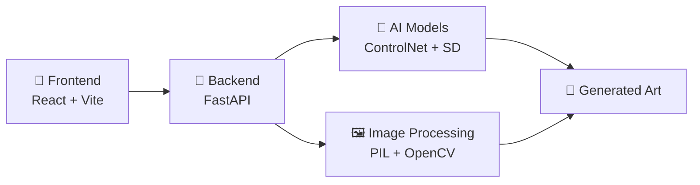

<div align="center">

# 🎨 AI-Powered Creative Intelligence Platform


<p align="center">
  
  
  
  
</p>

<p align="center">
  
  
  
</p>

---

### 🌟 Transform your sketches into stunning artwork with the power of AI

</div>

<div align="center">

## 🚀 Quick Start Guide


</div>

> 💡 **Pro Tip**: Use our automated setup scripts for the fastest installation experience!

### 📋 Prerequisites

<table>
<tr>
<td align="center"><br><b>Node.js 18+</b></td>
<td align="center"><br><b>Python 3.11</b></td>
<td align="center"><br><b>npm/pnpm</b></td>
<td align="center"><br><b>CUDA 11.8+</b><br><i>(optional)</i></td>
</tr>
</table>

### ⚡ Automated Setup (Recommended)

<div align="center">

| Platform | Command | Status |
|----------|---------|--------|
| 🪟 **Windows** | `scripts/setup.bat` |  |
| 🐧 **Linux** | `chmod +x scripts/setup.sh && ./scripts/setup.sh` |  |
| 🍎 **macOS** | `chmod +x scripts/setup.sh && ./scripts/setup.sh` |  |

</div>

### Manual Setup

1. **Install frontend dependencies:**
```bash
cd frontend && npm install && cd ..
```

2. **Install backend dependencies:**

**Option A - Auto-detect (recommended):**
```bash
cd backend && pip install -r requirements.txt && cd ..
```

**Option B - CPU-only (no GPU):**
```bash
cd backend && pip install -r requirements-cpu.txt && cd ..
```

**Option C - GPU with CUDA:**
```bash
cd backend && pip install -r requirements-gpu.txt && cd ..
```

3. **Set up environment files:**
```bash
cp .env.example .env
cp frontend/.env.example frontend/.env
cp backend/.env.example backend/.env
```

4. **Setup AI models (optional but recommended):**
```bash
cd backend
python scripts/setup-ai.py
```

5. **Configure Hugging Face token (for AI models):**
   - Get a free token at https://huggingface.co/settings/tokens
   - Add it to your `.env` file: `HUGGINGFACE_TOKEN=your_token_here`

6. **Start development servers:**
```bash
npm run dev
```

This will start:
- Frontend: http://localhost:5173
- Backend: http://localhost:8000
- API Docs: http://localhost:8000/docs

<div align="center">

## 🤖 AI Models & Architecture


</div>

<table align="center">
<tr>
<th>🎯 ControlNet</th>
<th>🎨 Stable Diffusion</th>
<th>🔄 Fallback Mode</th>
</tr>
<tr>
<td align="center">
<br>
Maintains your sketch's structure and composition
</td>
<td align="center">
<br>
Applies artistic styles from text prompts
</td>
<td align="center">
<br>
Works without AI models installed
</td>
</tr>
</table>

### 💻 System Requirements

<div align="center">

| Component | Minimum | Recommended | Optimal |
|-----------|---------|-------------|---------|
| 🧠 **RAM** | 8GB | 16GB | 32GB+ |
| 🎮 **GPU** | CPU Only | GTX 1060 6GB | RTX 3080+ |
| 💾 **Storage** | 5GB | 10GB | 20GB+ |
| ⚡ **VRAM** | N/A | 6GB | 12GB+ |

</div>

<div align="center">

## 🐍 Python Version Compatibility


</div>

<div align="center">

| Python Version | Status | Performance | Notes |
|----------------|--------|-------------|-------|
|  | ✅ | ⭐⭐⭐ | Minimum version |
|  | ✅ | ⭐⭐⭐⭐ | Stable |
|  | ✅ | ⭐⭐⭐⭐ | Stable |
|  | 🌟 | ⭐⭐⭐⭐⭐ | **Best performance** |
|  | ⚠️ | ⭐⭐⭐ | Some packages may have issues |

</div>

### 📦 Installation Options

<div align="center">

| Setup Type | Command | Use Case |
|------------|---------|----------|
| 🔄 **Auto-detect** | `pip install -r requirements.txt` | Let the system choose optimal packages |
| 💻 **CPU Only** | `pip install -r requirements-cpu.txt` | No GPU available |
| 🚀 **GPU Accelerated** | `pip install -r requirements-gpu.txt` | NVIDIA GPU with CUDA |
| 🏠 **Virtual Environment** | `python -m venv venv` | Isolated environment (recommended) |

</div>

<div align="center">

## 🏗️ Project Architecture


</div>

```
🎨 ai-creative-platform/
├── 🖥️  frontend/              # React + Vite + Tailwind CSS
│   ├── 📱 src/components/     # Reusable UI components
│   ├── 🎨 src/styles/         # Global styles & themes
│   └── ⚙️  vite.config.js     # Build configuration
├── 🔧 backend/               # FastAPI + Python AI Engine
│   ├── 🤖 models/            # AI model configurations
│   ├── 🛠️  api/               # REST API endpoints
│   └── 🧠 services/          # Core business logic
├── 🌍 .env                   # Environment variables
├── 📦 package.json           # Workspace configuration
└── 📖 README.md              # You are here!
```

<div align="center">

### 🔗 Service Communication


```mermaid
graph LR
    A[🎨 Frontend<br/>React + Vite] --> B[🔧 Backend<br/>FastAPI]
    B --> C[🤖 AI Models<br/>ControlNet + SD]
    B --> D[🖼️ Image Processing<br/>PIL + OpenCV]
    C --> E[🎯 Generated Art]
    D --> E
```

</div>

<div align="center">

## ✨ Features & Capabilities


</div>

<table>
<tr>
<td align="center" width="33%">
<br>
<h3>🎨 Interactive Canvas</h3>
<p>Sketch with customizable brushes, colors, and tools. Intuitive drawing experience with undo/redo support.</p>
</td>
<td align="center" width="33%">
<br>
<h3>🤖 AI Transformation</h3>
<p>ControlNet + Stable Diffusion preserve your sketch structure while applying stunning artistic styles.</p>
</td>
<td align="center" width="33%">
<br>
<h3>⚡ Real-time Generation</h3>
<p>Transform doodles into professional artwork in seconds with AI-powered processing.</p>
</td>
</tr>
<tr>
<td align="center">
<br>
<h3>💬 Style Prompts</h3>
<p>Describe your vision with natural language. "Make it cyberpunk", "Add watercolor effects", etc.</p>
</td>
<td align="center">
<br>
<h3>🎭 Beautiful UI</h3>
<p>Modern pastel interface with smooth animations and responsive design across all devices.</p>
</td>
<td align="center">
<br>
<h3>🔄 Fallback Mode</h3>
<p>Traditional image processing ensures functionality even without AI models installed.</p>
</td>
</tr>
</table>

<div align="center">

## 🛠️ Technology Stack


</div>

<table align="center">
<tr>
<th>🖥️ Frontend</th>
<th>🔧 Backend</th>
<th>🤖 AI/ML</th>
</tr>
<tr>
<td align="center">
<br>
<b>React 18</b><br>
<br>
<br>
<br>

</td>
<td align="center">
<br>
<b>FastAPI</b><br>
<br>
<br>
<br>

</td>
<td align="center">
<br>
<b>PyTorch</b><br>
<br>
<br>
<br>

</td>
</tr>
</table>

<div align="center">

---

## 🤝 Contributing


We welcome contributions! Please see our [Contributing Guide](CONTRIBUTING.md) for details.

<table>
<tr>
<td align="center">
<br>
<b>Report Bugs</b>
</td>
<td align="center">
<br>
<b>Submit PRs</b>
</td>
<td align="center">
<br>
<b>Share Ideas</b>
</td>
</tr>
</table>

## 📊 Project Stats

<div align="center">

</div>

## 📄 License


This project is licensed under the MIT License - see the [LICENSE](LICENSE) file for details.

---

<div align="center">

### 💜 Made with Love by **Rohith Cherukuri**


**⭐ Star this repo if you found it helpful!**

</div>

---

<div align="center">

</div>
